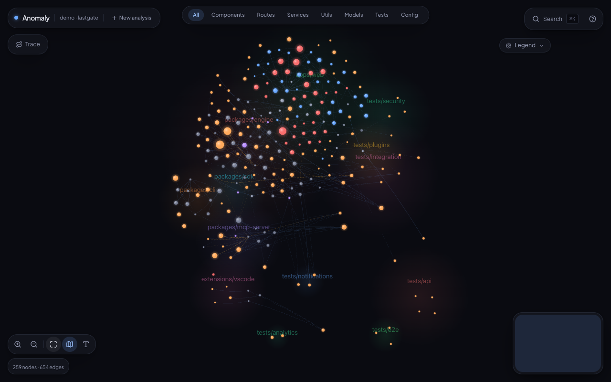

# Anomaly — Browser-Based Codebase Graph Visualizer

> See how any codebase connects.

Drop a folder or paste a GitHub URL. Anomaly parses the entire codebase in your browser and renders an interactive, neural-style force graph showing every file, every import, every function — instantly.

**Zero backend. Zero config. Zero API keys required.**



## Try It Live

**[anomaly-eta.vercel.app](https://anomaly-eta.vercel.app)**

Pre-loaded demos: Anomaly (self-referential), AgentForge, LastGate

## How It Works

1. **Load** — Drag-and-drop a project folder (File System API, works offline) or paste a GitHub URL (REST API from the browser)
2. **Parse** — @babel/parser for JS/TS/JSX/TSX, regex for Python/Java — all in the browser
3. **Build** — Graph data structure from import relationships with cluster detection
4. **Render** — D3.js force simulation on HTML5 Canvas with neural-style clustered lobes and glowing nodes

## Visual Style

Neural-network aesthetic — organic, clustered, alive:
- **Nodes**: Glowing neurons sized by connection count, colored by file type
- **Lobes**: Files in the same directory condense into distinct clusters connected by axon-like bundles
- **Synapses**: Faint resting connections that light up and fire signal pulses through the focused neighborhood on hover/select
- **Physics**: Real force simulation — grab a node and the whole graph responds

## Features

- **Hover** — Node glows brighter, connected edges highlight, tooltip with file info
- **Click** — Detail panel slides in with imports, exports, functions, and source code
- **Double-click** — Zoom into file's internal function graph
- **Drag** — Spring physics, connected nodes feel the pull
- **Scroll zoom** — Semantic zoom: labels appear at close range, clusters at distance
- **Cmd+K search** — Fuzzy search across files, functions, and exports
- **Filters** — Toggle file types: Components | Routes | Services | Utils | Tests | Config
- **Minimap** — Overview in the corner with click-to-navigate
- **Architecture rules** — Drop a `.anomaly.yml` in the scanned repo to declare intended layers and forbidden imports; violations render as red edges with a live drift score (see below)
- **AI Annotations** — Optional: enter your own OpenAI key in the UI for per-function summaries

### Architecture rules & drift detection

Declare your intended architecture in a `.anomaly.yml` at the repo root. Layers
are an ordered list, top to bottom — a layer may depend on layers *below* it,
never above. Backward dependencies and forbidden imports are drawn as red edges,
and the **Architecture** panel shows a drift score (the share of checked
dependencies that break the rules).

```yaml
# .anomaly.yml
layers:
  - name: ui
    paths: ["app", "components"]
  - name: logic
    paths: ["lib/graph", "lib/parser", "lib/loader", "lib/rules"]
  - name: foundation
    paths: ["lib/constants.ts", "lib/utils.ts"]
forbidden:
  - from: components      # components must not reach the loaders directly
    to: lib/loader
allow:
  - from: app             # but the app shell may
    to: lib/loader
```

## Tech Stack

| Layer | Technology |
|-------|-----------|
| App | Next.js (App Router), TypeScript, Tailwind CSS |
| Visualization | D3.js force simulation on HTML5 Canvas |
| AST Parsing | @babel/parser (JS/TS), regex (Python/Java) |
| AI (optional) | OpenAI GPT-4o-mini (user provides key) |
| Deployment | Vercel (static site, zero serverless) |

## Architecture

```
User drops folder or enters GitHub URL
      |
      v
File Loader (browser) -- File API or GitHub REST API
      |
      v
AST Parser (browser) -- @babel/parser for JS/TS, regex for Python/Java
      |
      v
Graph Builder (browser) -- nodes + edges from parsed data
      |
      v
D3 Force Graph (canvas) -- neural-style clustered visualization
```

### Why This Architecture

- **Actually deployable** — `vercel deploy` and it works. No cold starts, no sleeping backends.
- **Works on private repos** — drag-and-drop means no GitHub auth needed. Code never leaves the browser.
- **Instant** — local parsing is faster than any API round-trip. Sub-second for most repos.
- **Zero cost** — no backend hosting, no database, no API keys for core functionality.

## Supported Languages

| Language | Parsing | Route Detection |
|----------|---------|----------------|
| JavaScript/TypeScript | Full AST (@babel/parser) | Express, Next.js, Fastify |
| JSX/TSX | Full AST | React components |
| Python | Regex-based | FastAPI, Flask, Django |
| Java | Regex-based | Spring Boot |

## Local Development

```bash
git clone https://github.com/AaronCx/anomaly.git
cd anomaly
bun install
bun dev
```

No environment variables required. The app runs with zero configuration.

## Generate Demo Data

```bash
bun scripts/generate-demo.ts /path/to/repo demo-name
```

Outputs to `public/demos/demo-name.json`.

## Roadmap

- [ ] Go/Rust parser support
- [ ] Private repo support (GitHub OAuth)
- [ ] VS Code extension
- [ ] Diff visualization between commits
- [ ] Route tracing mode with animated path

## License

MIT
